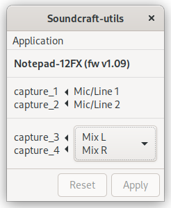
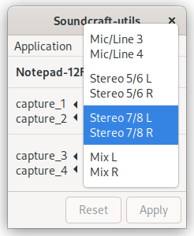

Linux Utilities for Soundcraft Mixers
=====================================

[Soundcraft Notepad](https://www.soundcraft.com/en/product_families/notepad-series)
mixers are pretty nice small-sized mixer boards with Harmon USB I/O built-in.
While the USB audio works great in alsa without any additional configuration
needed, there are some advanced features available to the Windows driver that
have no Linux equivalent.  Most importantly, the USB routing for the capture
channels is software-controlled, and requires an additional utility.  For
example, by default the Notepad-12FX sends the Master L&R outputs to USB
capture channels 3 and 4, but this routing can be changed to input 3&4, input
5&6, or input 7&8.  This tool aims to give this same software control of the
USB capture channel routing to Linux users.

Supported models:
- Notepad-12FX
- Notepad-8FX
- Notepad-5

Prerequisites
-------------

The D-Bus service relies on [PyGObject](https://pygobject.readthedocs.io/en/latest/index.html)
which is not available via pypi without a lot of dev libraries for
it to compile against.  It is usually easier to install separately
using your distribution's package installation tools:

Ubuntu:
```bash
sudo apt install python3-gi
```

Fedora:
```bash
sudo dnf install python3-gobject
```

Installation
------------

### Installation

```bash
sudo pip install soundcraft-utils
```

It is not recommended to use `--user` mode and install this
system-wide so that the D-Bus service auto-start can reliably find the
right python libs.

Set up the D-Bus service so it can access the system bus and be
auto-started on demand:

```bash
sudo soundcraft_dbus_service --setup
```

The D-Bus service will run as root, providing access to the underlying
USB device so the `soundcraft_ctl` user-facing part can be run by an
unprivileged account.

### Upgrading

Simply update your package from pip, and rerun the 'setup' to ensure
the D-Bus service is upgraded to the latest version:

```bash
sudo pip install -U soundcraft-utils
sudo soundcraft_dbus_service --setup
```


### Uninstallation

You can remove the D-Bus and xdg files first by running the following as root:

```bash
sudo soundcraft_dbus_service --uninstall
```

Then remove the package with pip:

```bash
sudo pip uninstall soundcraft-utils
```

### Prepared Packages

#### Arch Linux, Manjaro
soundcraft-utils are available in [AUR](https://aur.archlinux.org/packages/soundcraft-utils/): 

```bash
yay -S soundcraft-utils
```

#### NixOS
For NixOS there exists an experimental
[Nix expression](https://github.com/pakettiale/soundcraft-utils-nixos).
For instructions, check out the repo.

Usage
-----

### GUI

```bash
soundcraft_gui
```

- Select the desired input using the up and down arrow keys or using the mouse
- Apply the selection by clicking "Apply" (ALT+A)
- Instead of applying the selection, clicking "Reset" (ALT+R) will set the
  selection back to the current state of the mixer (if known)




### CLI

List possible channel routing choices:

```bash
soundcraft_ctl [--no-dbus] -l
```

Set channel routing:

```bash
soundcraft_ctl [--no-dbus] -s <number>
```

When using the `--no-dbus`, write access to the underling USB device is
required. Normally only root can do this, unless you've added some custom
udev rules.

TODO
----

- Polkit restrictions on the D-Bus service
- Multiple device support
- Auto-duck feature
- Firmware upgrade
